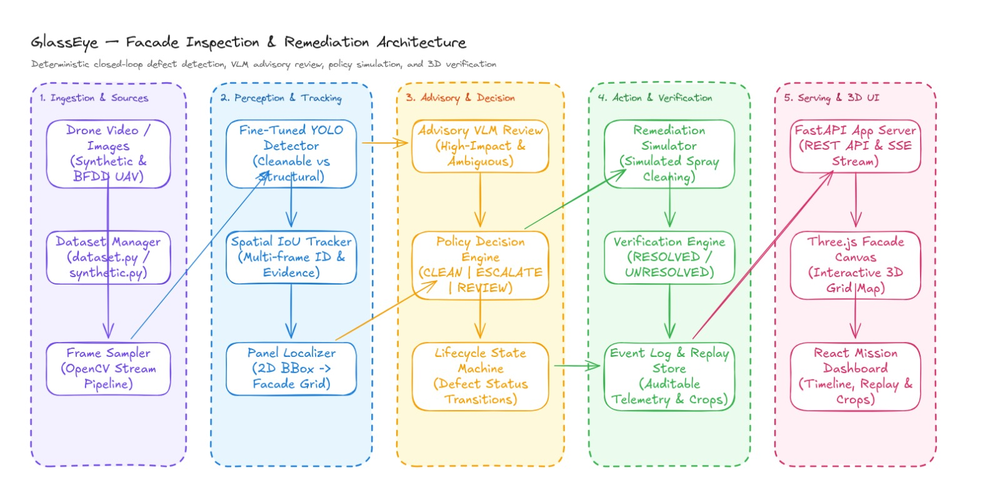
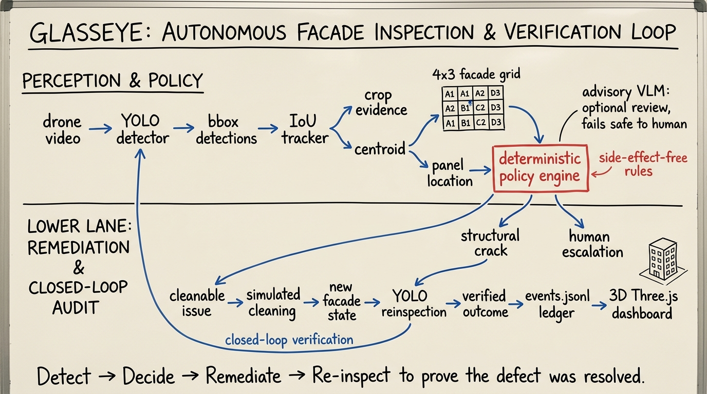

# GlassEye

**AI-Powered Façade Inspection & Remediation Simulator**

GlassEye is an end-to-end building façade inspection platform combining fine-tuned YOLO defect detection, 4×3 panel localization, automated policy recommendations, advisory VLM reviews, and a closed-loop drone mission simulator with a 3D Three.js dashboard.

[](https://huggingface.co/sanjeevafk/glasseye-yolo)
[](https://glasseye-td75.onrender.com)

---

## System Topology & Architecture

### Autonomous Inspection Loop


### System Architecture & Whiteboard Design


---

## Features

- **Interactive Façade Scanner**: Upload any building façade photo or choose 1-click test presets to get instant YOLO defect bounding boxes, 4×3 panel grid coordinates, and a 0–100 Façade Integrity Index.
- **Automated Dispatch Policy**: Recommends actionable steps (`SIMULATED CLEAN APPROVAL`, `MANDATORY STRUCTURAL ESCALATION`, `MAINTENANCE SCHEDULE`).
- **Advisory VLM Second Opinions**: Routes high-impact defect crops to a Vision-Language Model for independent second-opinion verification.
- **Closed-Loop Drone Simulation**: Replays a full drone flight scenario with video inference, IOU tracking, simulated cleaning commands, and post-remediation verification.
- **Three.js 3D Panel Map**: Visualizes real-time status (`resolved`, `escalated`, `active`) across building geometry with automatic 2D fallback for headless/non-WebGL environments.

---

## Quickstart

### 1. Installation

```bash
make setup
```

### 2. Run Local Application

Start backend (FastAPI):
```bash
make backend
```

In a second terminal, start frontend (Vite / React):
```bash
make frontend
```

Open [http://127.0.0.1:5173](http://127.0.0.1:5173) in your browser.

### 3. Run Automated Tests

```bash
# Run backend tests + ruff linting
.venv/bin/ruff check .
PYTHONPATH=backend .venv/bin/pytest backend/tests -q

# Run frontend Playwright E2E browser tests
npm --prefix frontend run test:e2e
```

---

## Trained Model Checkpoints

The active production model is trained on real Building Façade Defect Dataset (BFDD), CUBIT concrete defects, and high-altitude UAV2K aerial drone surveys:

- **Hugging Face Hub**: [`sanjeevafk/glasseye-yolo`](https://huggingface.co/sanjeevafk/glasseye-yolo)
- **Local Checkpoint**: `models/glasseye-yolo-bfdd-cubit-v1/best.pt`

### Python Inference Snippet

```python
from ultralytics import YOLO

model = YOLO("models/glasseye-yolo-bfdd-cubit-v1/best.pt")
results = model.predict("backend/app/samples/spalling_damage_sample.jpg", conf=0.15)
results[0].show()
```

---

## Production Deployment

The application runs as a single self-contained Docker container serving the compiled React frontend and FastAPI backend on a single port:

```bash
docker build -t glasseye-demo .
docker run -p 8000:8000 glasseye-demo
```

Open [http://127.0.0.1:8000](http://127.0.0.1:8000). A `render.yaml` blueprint is included for 1-click cloud deployment.

---

## Documentation

- [`docs/architecture.md`](docs/architecture.md): Core system design and state machines
- [`docs/sahi-inference.md`](docs/sahi-inference.md): Sliced Aided Hyper Inference (SAHI) and high-res drone benchmark metrics
- [`docs/data-card.md`](docs/data-card.md): Dataset sources, licensing, and annotation schemas
- [`docs/bfdd-cubit-experiment.md`](docs/bfdd-cubit-experiment.md): Benchmark results across BFDD, CUBIT, and UAV2K
- [`docs/cubit-data-card.md`](docs/cubit-data-card.md): CUBIT concrete defect dataset card
- [`docs/uav2k-data-card.md`](docs/uav2k-data-card.md): UAV2K high-resolution drone façade dataset card
