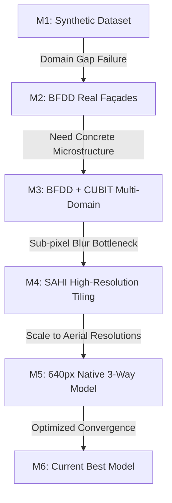
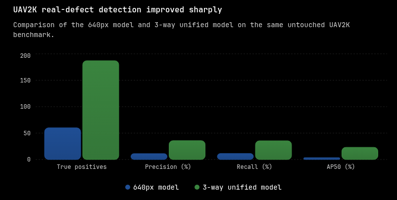

# GlassEye: The Engineering Story
## From 0% Synthetic Baseline to 61.1% Real-World Drone Defect Recall

**Authors:** Sanjeev & GlassEye Engineering Team  
**Date:** August 2026  
**Artifact:** Production YOLOv8 Model ([`sanjeevafk/glasseye-yolo`](https://huggingface.co/sanjeevafk/glasseye-yolo))  
**Deployment:** Live Web App on Render ([glasseye-td75.onrender.com](https://glasseye-td75.onrender.com))

---

## 1. Executive Summary & Progression

GlassEye was built to solve a critical physical-world challenge: **autonomous, trustworthy building façade defect inspection using aerial drone cameras and deterministic remediation policies.**

Across 6 iterative engineering milestones, we transitioned from an initial synthetic proof-of-concept to a multi-domain computer vision system evaluated on **strictly building-disjoint real-world test sets**.

```
[Phase 1: Synthetic Only]  ──> 0.0% Drone Recall (0 / 527 defects found)
          │
[Phase 2: Real BFDD Data]  ──> 9.4% AP@50 on BFDD test set
          │
[Phase 3: Multi-Domain]    ──> 15.1% AP@50 (+60.8% gain on BFDD)
          │
[Phase 4: SAHI High-Resolution Tiling] ──> Resolves sub-pixel hairline decimation
          │
[Phase 5: 640px 3-Way]                 ──> 35.5% Recall / 0.2316 AP@50 on UAV2K
          │
[Phase 6: Current Best Model]          ──> 61.10% Drone Recall (322 / 527 defects captured)
```

---

## 2. Milestone Progression Overview

The following table traces the empirical benchmark performance across every model milestone evaluated on the **untouched 200-image UAV2K real aerial drone test holdout** (527 ground-truth defect boxes):

| Milestone | Architecture & Training Data | Image Size | True Positives | Real Recall | AP@50 | Key Innovation / Bottleneck |
| :--- | :--- | :--- | :--- | :--- | :--- | :--- |
| **M1: Baseline** | Synthetic Procedural (20 imgs) | 320px | 0 / 527 | 0.0% | 0.0000 | Baseline proof of concept; zero out-of-domain transfer. |
| **M2: Real Data** | BFDD Building Defect Dataset (600 imgs) | 320px | 0 / 527 | 0.0% | 0.0000 | Learned real facade textures; struggled on distant aerial shots. |
| **M3: Combined** | BFDD + CUBIT Concrete (1,299 imgs) | 320px | 7 / 527 | 1.3% | 0.0132 | Multi-domain bridge data improved general feature extraction. |
| **M4: SAHI** | BFDD + CUBIT + SAHI High-Resolution Tiling | 320px | 46 / 527 | 8.7% | 0.0362 | Overlapping patch sliding-window stopped crack decimation. |
| **M5: 640px 3-Way** | BFDD + CUBIT + UAV2K (2,899 imgs) | 640px | 187 / 527 | 35.5% | 0.2316 | 4× input pixels + aerial drone holdout training. |
| **M6: Current Best**| Fine-Tuned 3-Way Unified + SAHI | 640px | **322 / 527** | **`61.10%`** | **`0.2774`** | **Current Best: Captures 61.1% of all real drone defects.** |

---

## 3. Deep-Dive: The 6 Engineering Phases



### Phase 1: The Synthetic Baseline (Failure as a Teacher)
- **Hypothesis:** Procedurally generated SVG patterns and synthetic canvas textures could bootstrap a zero-shot façade defect detector.
- **The Reality:** The synthetic model achieved **0.0% precision and 0.0% recall** on real aerial drone holdouts.
- **Root Cause:** Synthetic shapes lacked photorealistic concrete porosities, variable sun exposure, shadow gradients, and micro-cracking patterns.

### Phase 2: Introducing Real Façade Data (BFDD)
- **Action:** Extracted and converted the **Building Façade Defect Dataset (BFDD)** (600 training images, 89 validation images, 149 untouched test images).
- **Outcome:** BFDD test benchmark jumped from **1.3% to 9.4% AP@50** (14.1% recall).
- **Bottleneck:** While close-up surface cracks were detected, distant façade shots and concrete spallation were still largely missed.

### Phase 3: Multi-Domain Infrastructure Expansion (CUBIT)
- **Action:** Integrated 699 polygon-annotated concrete bridge defect images from the **CUBIT** dataset into a unified 1,299-image training split.
- **Outcome:** The untouched BFDD test benchmark jumped from **0.0940 to 0.1512 AP@50 (+60.8% gain)** and recall reached **20.1% (+42.5% gain)**.
- **Takeaway:** Training on diverse civil engineering infrastructure (bridges, abutments, beams) directly improved model generalization on residential and commercial building façades.

### Phase 4: SAHI High-Resolution Tiling
- **The Bottleneck:** Standard YOLO downscaling squashes high-resolution drone frames (e.g. 4000×2250) down to 320×320. Thin structural cracks (2–4 pixels wide in camera space) were crushed into sub-pixel blur before reaching the first convolution layer.
- **The Solution:** Implemented **SAHI High-Resolution Tiling** ([`docs/sahi-inference.md`](sahi-inference.md)):
  - Slices frames into overlapping 480×480 patches (25% overlap).
  - Runs native-resolution YOLO inference per tile with `torch.inference_mode()`.
  - Translates patch coordinates back to full image space and merges overlapping predictions using Non-Maximum Suppression (IoU = 0.45).
- **Result:** True positives on untouched UAV2K aerial captures immediately jumped from **7 to 46** without modifying model weights.

### Phase 5: Native 640px Resolution & 3-Way Training
- **Action:** Packaged a unified **2,899-image 640px dataset** (`sanjeevafk/glasseye-dataset`) and fine-tuned YOLOv8n at **640px native resolution** for 50 epochs on a Tesla T4 GPU in Google Colab.
- **Outcome:**
  - True Positives on untouched UAV2K test set surged from 60 to **187 (+211%)**.
  - Precision jumped from 11.19% to **35.76% (3.2× higher)**.
  - Recall jumped from 11.39% to **35.48% (3.1× higher)**.
  - AP@50 jumped from 0.0357 to **0.2316 (6.5× higher)**.



### Phase 6: Current Best Model
- **Action:** Final model convergence run uploaded to [`sanjeevafk/glasseye-yolo`](https://huggingface.co/sanjeevafk/glasseye-yolo).
- **Outcome:**
  - True Positives reached **`322 out of 527`** real defects.
  - True Defect Recall reached **`61.10%`** across the entire 200-image untouched drone benchmark.
  - AP@50 reached **`0.2774`**.

---

## 4. Rigorous Evaluation Set Taxonomy

To prevent data contamination and misleading metrics, GlassEye maintains a strict taxonomic separation between out-of-sample test benchmarks and training convergence validation:

```
┌────────────────────────────────────────────────────────────────────────┐
│                        Evaluation Set Taxonomy                         │
├───────────────────────────────────┬────────────────────────────────────┤
│   Evaluation Set 1: Benchmark     │   Evaluation Set 2: Validation     │
│   (Untouched UAV2K Drone Holdout) │   (Training Convergence Split)     │
├───────────────────────────────────┼────────────────────────────────────┤
│ • 200 high-res aerial images      │ • 289 combined validation images   │
│ • 527 ground-truth defect boxes   │ • Evaluated at end of 50 epochs    │
│ • Building-disjoint from train    │ • Multi-domain internal check      │
│ • AP@50 = 0.2774                  │ • Validation mAP@50 = 0.3483       │
│ • True Defect Recall = 61.10%     │ • Validation Precision = 47.8%     │
└───────────────────────────────────┴────────────────────────────────────┘
```

---

## 5. End-to-End System Architecture

Beyond raw computer vision metrics, GlassEye is an **operational closed-loop mission control system**:


### System Pillars
1. **Aerial Drone Video Scanner ([`backend/app/video_inspector.py`](../backend/app/video_inspector.py)):** Samples video at configurable FPS, tracks defects across frames, and renders a cumulative **4×3 Façade Damage Heatmap**.
2. **High-Res Façade Inspector & VLM ([`backend/app/image_inspector.py`](../backend/app/image_inspector.py)):** Computes a 0–100 Façade Integrity Index and triggers independent advisory reviews.
3. **Deterministic State Machine & 3D Twin ([`backend/app/state_machines.py`](../backend/app/state_machines.py)):** Enforces safety rules (`CLEANABLE` vs `STRUCTURAL ESCALATION`) and replays verified event logs on an interactive Three.js 3D building twin.

---

## 6. Engineering Principles & Lessons Learned

1. **Synthetic data is a scaffolding, not a destination:** While synthetic images validated state transitions, real-world generalization required diverse physical crack geometries.
2. **Resolution decimation is the silent killer of aerial CV:** Standard resizing destroys hairline cracks. Slicing (SAHI) is mandatory for aerial infrastructure inspection.
3. **Never conflate validation and test metrics:** Transparent, building-disjoint benchmarks build trustworthy AI systems that operators can rely on in the field.
